# はじめに

この本で触る Symbol は、

正しさを記録し、
それを証明することを
得意としたブロックチェーンです。

この本は、
Symbol を理解するための本ではありません。

また、
ブロックチェーンを学習するための本でもありません。

この本は、
**Symbol に触るための「入口体験キット」**です。

これまで、ブロックチェーンの入門やハンズオンでは、

- その場でコードを動かす
- 動いたことを確認する

ところまで進んで、終わることが少なくありません。

それ自体は、悪いことではありません。

ただ、時間が経ってから、

「もう一度、同じことを自分ひとりでできるか」

と考えると、少し不安になることがあります。

多くの場合、体験はしていても、
手元に残るものが少ないからです。

---

この本のゴールは、

- アカウントを作り
- トランザクションを送って
- 「自分で何かを作れる」ところまで進む

ことです。

その過程で、
Symbol ならではの仕組みとして
モザイクやメタデータに触れます。

ああ、Symbol ってこういうブロックチェーンなんだな

と感じるところまでです。

それ以上進むかどうかは、
読者自身が決めてください。

この本は薄く、安く、
半日程度のハンズオンでも使える規模を想定しています。

途中で止めてもかまいません。
分からないところがあっても問題ありません。

大切なのは、

家に帰ってから、
もう一度ひとりで実行できる状態になること

それだけです。

もしこの本を読み終えて、

もう少し触ってみようかな

と思えたなら、
それがこの「入口体験キット」の役割です。

ここまでで、
もう十分です。

それでは、
アカウントを作るところから始めましょう。

---

# 序章：準備

## Volta で Node.js を用意する

この本では、Node.js を使います。
Node.js の入れ方はいくつもありますが、ここでは Volta だけを使います。

理由はひとつです。

> 余計なことを考えさせないためです。

Volta は、Node.js のバージョン管理ツールです。
一度入れてしまえば、細かい設定を意識せずに Node.js を使えます。

## 1. Volta をインストールする

以下のコマンドを そのまま 実行してください。

```bash
curl https://get.volta.sh | bash
```

実行後、ターミナルを 一度閉じてから開き直します。

## 2. Volta が使えることを確認する

次のコマンドを実行します。

```bash
volta --version
```

バージョン番号が表示されれば、Volta のインストールは完了です。

## 3. Node.js をインストールする

次に、Node.js を入れます。

```bash
volta install node
```

この本では、
Node.js のバージョンは Volta に任せます。

自分でバージョンを選ぶ必要はありません。

## 4. Node.js が動くことを確認する

最後に、Node.js が使えるか確認します。

```bash
node --version
```

```bash
npm --version
```

どちらもバージョン番号が表示されれば成功です。

## 5. プロジェクトを作成する

次に、
この本で使う 作業場所 を用意します。

任意の場所で、
次のコマンドを実行してください。

```bash
mkdir symbol-intro
cd symbol-intro
```

このディレクトリが、
この本を通して使うプロジェクトになります。

## 6. 最低限の設定ファイルを用意する

ここでは、
TypeScript を動かすための
最低限の設定だけを用意します。

### 6.1 package.json を作成する

次のコマンドを実行します。

```bash
npm init -y
```

細かい設定は不要です。
すべてそのままで構いません。

### 6.2 必要なパッケージをインストールする

この本で使うライブラリをインストールします。

```bash
npm i symbol-sdk
npm i -D tsx
```

これで、

```bash
npx tsx ファイル名.ts
```

という形で、
TypeScript をそのまま実行できるようになります。

### 6.3 tsconfig.json を作成する

次に、
TypeScript の設定ファイルを作ります。

プロジェクト直下に
`tsconfig.json` というファイルを作成し、
次の内容を入力してください。

```json
{
  "compilerOptions": {
    "target": "ES2020",
    "module": "ESNext",
    "moduleResolution": "bundler",
    "strict": true
  }
}
```

この設定の意味は、
今は理解しなくて構いません。

この本では、
このまま使い続けます。

## 7. 準備完了

ここまでで、
次の状態になっていれば準備は完了です。

- Volta が使える
- Node.js が動く
- プロジェクトディレクトリがある
- npx tsx が使える

このあとは、
TypeScript でコードを書いて、
実行するだけです。

補足：
エディタは指定しません。
テキストファイルを編集できるものであれば、
何を使っても構いません。

# 第1章 アカウントを作る

この章では、
Symbol 上で使うアカウントを1つ作ります。

ここでは、
まだ何かを送ったり、
ネットワークにつないだりはしません。

作って、保存するだけです。

## 1.1 この章の目的

この章の目的は、次の3つです。

- ニーモニックを生成する
- そこからアカウントを作る
- 後で使うために保存する

これだけで、
Symbol を触るための準備が整います。

## 1.2 ニーモニックについて

ニーモニックは、
複数の英単語でできた文字列です。

この文字列があれば、

- 同じアカウントを
- 何度でも
- どこでも

復元できます。

今は
「アカウントの元になる合言葉」
くらいに思ってください。

このあと、
このニーモニックから
実際のアカウントを作ります。

## 1.3 ファイルを作る

作業ディレクトリで、
次のファイルを作成します。

```text
1_account.ts
```

## 1.4 ニーモニックからアカウントを作る

1_account.ts を開き、
以下のコードを入力してください。

```ts
import { Bip32 } from "symbol-sdk";
import { Network, SymbolFacade } from "symbol-sdk/symbol";

// ニーモニック生成
const bip32 = new Bip32();
const mnemonic = bip32.random();
console.log("Mnemonic:", mnemonic);

// ニーモニックからアカウント生成
const password = "";
const bip32Node = bip32.fromMnemonic(mnemonic, password);

const facade = new SymbolFacade(Network.TESTNET);
const bip32Path = facade.bip32Path(0);
const childBip32Node = bip32Node.derivePath(bip32Path);
const keypair = SymbolFacade.bip32NodeToKeyPair(childBip32Node);
const account = facade.createAccount(keypair.privateKey);
console.log("===");
console.log(`PrivateKey: ${account.keyPair.privateKey}`);
console.log(`PublicKey : ${account.publicKey}`);
console.log(`Address   : ${account.address}`);
```

このコードは、

- ランダムなニーモニックを作り
- そこからアカウントを作り
- 必要な情報を表示する

それだけのものです。

## 1.5 実行する

次のコマンドを実行します。

```bash
npx tsx 1_account.ts
```

実行すると、次のような表示が出ます。

```text
Mnemonic: word1 word2 word3 ...
===
PrivateKey: xxxxxxxxxxxxxxxxxxxxxxxxxxxxxxxxxx
PublicKey : xxxxxxxxxxxxxxxxxxxxxxxxxxxxxxxxxx
Address   : Txxxxxxxxxxxxxxxxxxxxxxxxxxxxxxxxx
```

このニーモニックは、
あなただけのものです。

※ この章では、
アカウントの中身が見えるように
あえて秘密鍵も表示しています。

## 1.6 ニーモニックを保存する

表示されたニーモニックは、
この本を通して使います。

- メモ帳に保存する
- 紙に書き写す
- コピーできる状態にしておく

必ず消えない形で残してください。

※ この本では
　安全な保管方法については扱いません。

## 1.7 この章のまとめ

この章を通して、次のものが手元に残りました。

- 自分のニーモニックを持っている
- それに対応するアドレスが分かる
- コードでアカウントを作れたという実感

これで、  
このアカウントをウォレットで使う準備が整いました。

# 第2章 ウォレットを用意する

この章では、
Symbol デスクトップウォレットをインストールし、
第1章で作ったニーモニックを登録します。

まだトランザクションは送りません。
ネットワークにも接続しません。

自分のアカウントを「見える形」にする
それだけを行います。

## 2.1 この章の目的

この章で行うのは、次の2つです。

- デスクトップウォレットをインストールする
- ニーモニックを登録してプロファイルを作る

これで、
コードで作ったアカウントを
ウォレット上で扱えるようになります。

## 2.2 ウォレットは「結果を見る箱」

この本では、
ウォレットを次のように扱います。

- 操作の中心にはしない
- 設定を細かく説明しない
- 結果を確認するための道具として使う

Symbol SDK で作ったものを、
「本当に存在しているか」
目で確認する場所です。

## 2.3 デスクトップウォレットをインストールする

Symbol デスクトップウォレットを
公式サイトからインストールしてください。

この本では OS 毎のインストール方法の差をなくすため、ブラウザで動作するバージョンのウォレットを使用します。

https://github.com/symbol/desktop-wallet/releases

上記ページから
`symbol-desktop-wallet_x.x.x.all.zip`
をダウンロードして解凍して、任意の場所に配置してください。

`index.html` をダブルクリックしてウォレットを起動してください。

## 2.4 プロファイルを作成する

ここでは、
画面の流れに沿って進めるだけで構いません。
細かい意味は気にしなくて大丈夫です。

ウォレットを初めて起動すると、
プロファイル作成画面が表示されます。

ここでは、
ニーモニックからプロファイルを作成します。

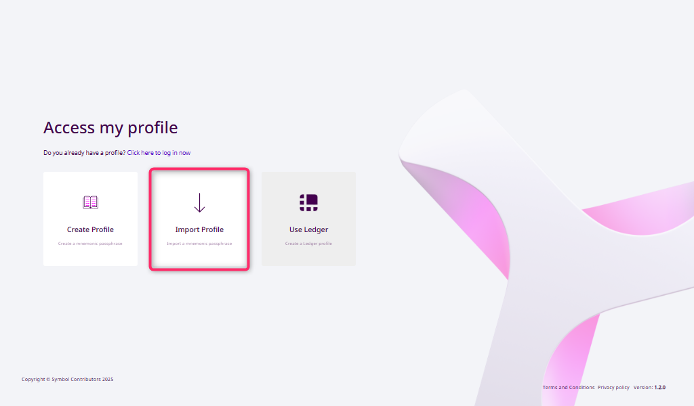
図2-1 プロファイル作成

Import Profile を選択します。

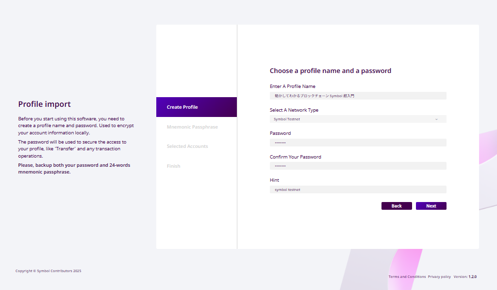
図2-2 インポートプロファイル

以下を入力します。

- Enter A Profile Name: 任意のプロファイル名
- Select A Network Type: Symbol Testnet
- Password: パスワード
- Confirm Your Password: パスワード（確認用）
- Hint: パスワードを忘れたときのためのヒント

入力が終わったら Next ボタンを押してください。

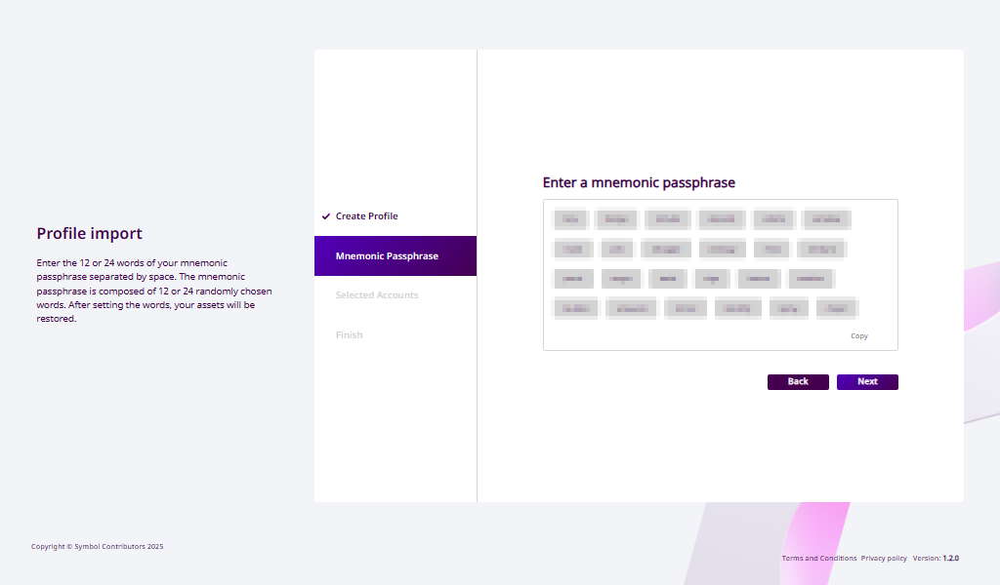
図2-3 ニーモニックのインポート

第1章で生成したニーモニックをテキストボックスに貼り付けます。

入力が終わったら Next ボタンを押してください。

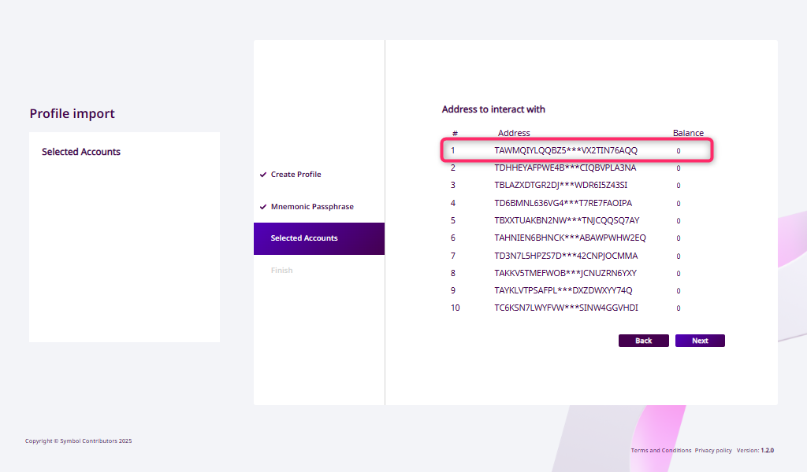
図2-4 アドレスの選択

アドレスが表示されるので、一番上を選択します。

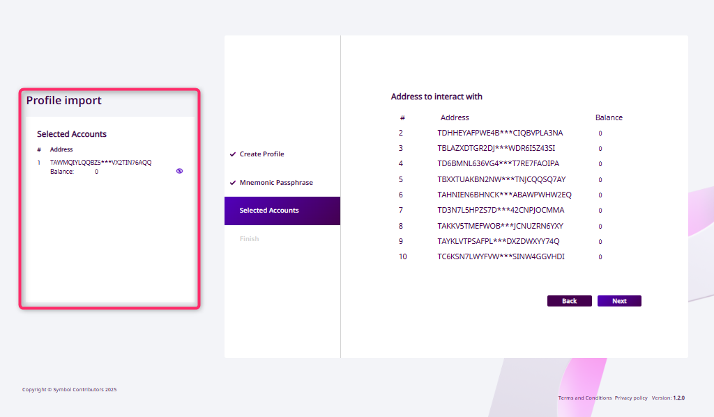
図2-5 アドレスの選択後

選択したアドレスが左のリストに表示されていることを確認します。

確認できたら Next ボタンを押してください。

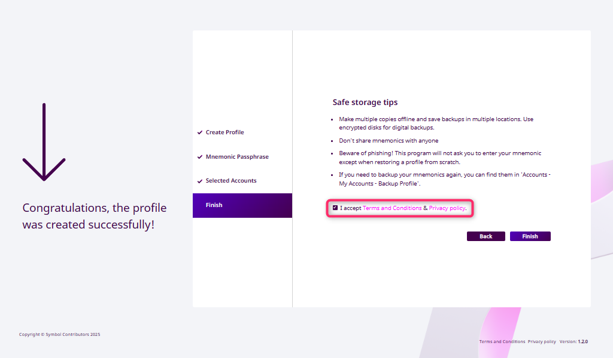
図2-6 利用規約・プライバシーポリシー同意

利用規約・プライバシーポリシーを確認しチェックします。

Finish ボタンを押してください。

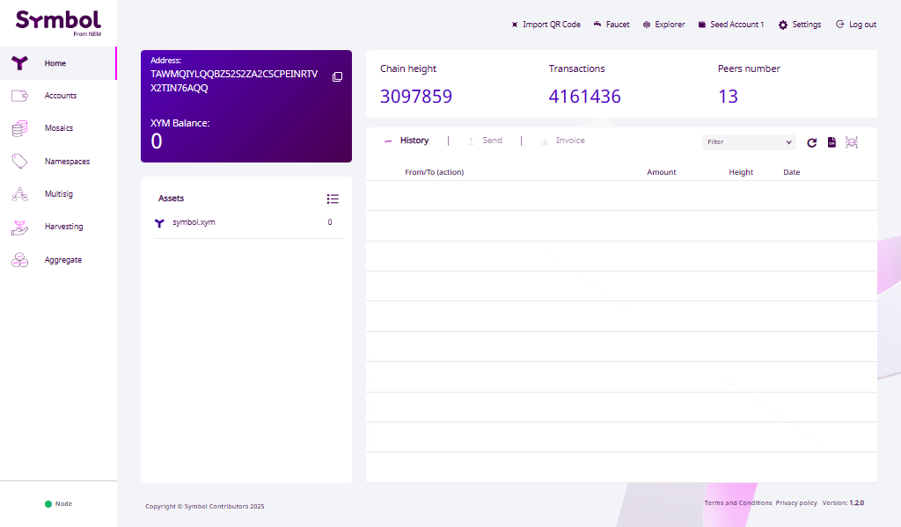
図2-7 ホーム画面

ウォレットにアカウントが表示されます。

- アドレスが表示されている
- 残高は 0 のままで問題ない

このアドレスは、
第1章のコードで表示されたものと
同じものです。

一致していれば、正しく登録できています。

## 2.5 この章のまとめ

この章を通して、次のことが確認できました。

- デスクトップウォレットを起動できる
- ニーモニックからプロファイルを作成できた
- 自分のアカウントがウォレットに表示されている

これで、  
このアカウントを使って
実際に動かす準備が整いました。

# 第3章 送ってみる（トランザクション）

この章では、
Symbol のネットワークにトランザクションを送ります。

ここで初めて、

- コードで作ったものが
- ネットワークに届き
- ウォレットに反映される

という体験をします。

細かい仕組みは説明しません。
送って、見て、感じるだけです。

## 3.1 この章の目的

この章の目的は、次の3つです。

- トランザクションを1つ作る
- ネットワークに送信する
- ウォレットで結果を確認する

これだけです。

## 3.2 手数料の準備について

トランザクションを送るには、
**少量の XYM（テストネット用）** が必要です。

この本では、
あらかじめ用意された配布ページから
必要な分だけ受け取って進めます。

配布ページを開き、
自分のアドレスを入力してください。

ウォレットに残高が表示されれば、
次に進めます。

<!-- 配布ページは後で作成 -->

## 3.3 ファイルを作る

次のファイルを作成してください。

```text
3_transfer.ts
```

## 3.4 トランザクションを書く

このコードでは、
Symbol SDK の内部的なクラスもいくつか使っています。

今は、
すべてを理解する必要はありません。
「送れる」という体験が目的です。

`3_transfer.ts` を開き、
次のコードを入力してください。

```ts
import { Bip32 } from "symbol-sdk";
import {
  descriptors,
  models,
  Network,
  SymbolFacade,
  SymbolTransactionFactory,
} from "symbol-sdk/symbol";

const NODE_URL = "https://sym-test-01.opening-line.jp:3001";

// 第1章で作成したニーモニックを貼り付ける
// const mnemonic = "ここに自分のニーモニックを書く";
const mnemonic = "word1 word2 word3 word4 ...";
const password = "";
const bip32Node = new Bip32().fromMnemonic(mnemonic, password);

// アカウント生成
const facade = new SymbolFacade(Network.TESTNET);
const bip32Path = facade.bip32Path(0); // 最初のアカウント
const childBip32Node = bip32Node.derivePath(bip32Path);
const keypair = SymbolFacade.bip32NodeToKeyPair(childBip32Node);
const account = facade.createAccount(keypair.privateKey);

// 転送モザイク設定
const mosaics = [
  new descriptors.UnresolvedMosaicDescriptor(
    new models.UnresolvedMosaicId(0x72c0212e67a08bcen), // XYMモザイクID（テストネット）
    new models.Amount(2_000000n), // 転送量
  ),
];

// 平文メッセージ
const message = new TextEncoder().encode("\0Hello, Symbol!!");

// 転送トランザクションディスクリプタ生成
const transferTxDescriptor = new descriptors.TransferTransactionV1Descriptor(
  account.address, // 受信者アドレス（自分自身）
  mosaics, // 転送モザイク
  message, // メッセージ
);
// 転送トランザクション生成
const transferTx = facade.createTransactionFromTypedDescriptor(
  transferTxDescriptor,
  account.publicKey, // 送信者公開鍵
  100, // 手数料係数
  60 * 60 * 2, // 有効期限(秒)
);

// 転送トランザクションに署名
const sig = account.signTransaction(transferTx);
const payloadJsonString = SymbolTransactionFactory.attachSignature(
  transferTx,
  sig,
);

// ノードへアナウンス（送信）
fetch(new URL("/transactions", NODE_URL), {
  method: "PUT",
  headers: { "Content-Type": "application/json" },
  body: payloadJsonString,
})
  .then((res) => res.json())
  .then((json) => {
    console.log(JSON.stringify(json));
  })
  .catch((err) => {
    console.error(err);
  });
```

このコードは、

- 自分自身に送る
- メッセージ付きのトランザクションを作り
- 署名して
- ネットワークに通知する

それだけのものです。

## 3.5 実行する

次のコマンドを実行します。

```bash
npx tsx 3_transfer.ts
```

実行後、次のような表示が出ます。

```text
{"message":"packet 9 was pushed to the network via /transactions"}
```

この表示が出れば、
トランザクションは送信されています。

## 3.6 ウォレットで確認する

デスクトップウォレットを開き、
自分のアカウントを表示してください。

少し待つと、トランザクション履歴に「Hello, Symbol!!」というメッセージ付きの新しい履歴が表示されます。

それが、
今送ったトランザクションです。

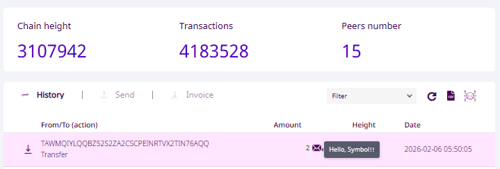
図3-6-1 ホーム画面 - トランザクション履歴

## 3.7 この章のまとめ

- コードからトランザクションを送信できた
- ウォレットに履歴が表示されている
- ネットワークに届いた感覚がある

ここまで来ると、
トランザクションは
特別なものではなくなってきます。

次は、
残り続けるものを作ってみましょう。

# 第4章 残るものを作る（モザイク）

モザイクは、
Symbol 上で使える独自の単位です。

通貨のようにも、
チケットのようにも、
単なる目印のようにも使えます。

ここから、
トランザクションが
「一瞬の出来事」ではなくなる感覚が出てきます。

## 4.1 この章の目的

この章の目的は、次の3つです。

- モザイク定義トランザクションを作る
- 作ったモザイクを送信する
- 送信したモザイクを回収する

`symbol.xym` 以外のモザイクを送り、回収します。

その結果、
「送ったのに終わらない」
という感触を体験します。

## 4.2 モザイクを定義する

### 4.2.1 ファイルを作る

次のファイルを作成してください。

`4_2_mosaic.ts`

### 4.2.2 モザイクを定義するコードを書く

`4_2_mosaic.ts` を開き、
次のコードを入力してください。

この章のコードは、次のことを行っています。

1. モザイク定義Txを作成
1. 定義したモザイクの初期数量を設定するTxを作成
1. 2つのトランザクションをまとめる集約Txを作成
1. 集約Txに署名
1. アナウンス

<!-- コードをすべて理解しようとしなくて構いません。
そのまま写して、実行してください。 -->

```ts
import { Bip32 } from "symbol-sdk";
import {
  descriptors,
  generateMosaicId,
  models,
  Network,
  SymbolFacade,
  SymbolTransactionFactory,
} from "symbol-sdk/symbol";

const NODE_URL = "https://sym-test-01.opening-line.jp:3001";

// 第1章で作成したニーモニックを貼り付ける
// const mnemonic = "ここに自分のニーモニックを書く";
const mnemonic = "word1 word2 word3 word4 ...";
const password = "";
const bip32Node = new Bip32().fromMnemonic(mnemonic, password);

// アカウント生成
const facade = new SymbolFacade(Network.TESTNET);
const bip32Path = facade.bip32Path(0); // 最初のアカウント
const childBip32Node = bip32Node.derivePath(bip32Path);
const keypair = SymbolFacade.bip32NodeToKeyPair(childBip32Node);
const account = facade.createAccount(keypair.privateKey);

// モザイクフラグ設定
let f = models.MosaicFlags.NONE.value;
// f += models.MosaicFlags.SUPPLY_MUTABLE.value; // 供給量変更の可
// f += models.MosaicFlags.TRANSFERABLE.value;   // 第三者への譲渡可
// f += models.MosaicFlags.RESTRICTABLE.value;   // 制限設定の可
f += models.MosaicFlags.REVOKABLE.value; // 発行者からの還収可
const flags = new models.MosaicFlags(f);

// ナンス設定
const array = new Uint8Array(models.MosaicNonce.SIZE);
crypto.getRandomValues(array);
const nonce = models.MosaicNonce.deserialize(array);

//モザイク定義
const mosaicDefDescriptor =
  new descriptors.MosaicDefinitionTransactionV1Descriptor( // モザイク定義Tx
    new models.MosaicId(
      generateMosaicId(account.address, nonce.value as number),
    ), // モザイクID
    new models.BlockDuration(0n), // 有効期限(0:無期限)
    nonce, // ナンス
    flags, // モザイクフラグ
    2, // 可分性
  );
const mosaicDefTx = facade.createEmbeddedTransactionFromTypedDescriptor(
  mosaicDefDescriptor, // トランザクション Descriptor 設定
  account.publicKey, // 署名者公開鍵
) as models.EmbeddedMosaicDefinitionTransactionV1;
//モザイク変更
const mosaicChangeDescriptor =
  new descriptors.MosaicSupplyChangeTransactionV1Descriptor( // モザイク変更Tx
    new models.UnresolvedMosaicId(mosaicDefTx.id.value as bigint), // モザイクID
    new models.Amount(10000n), // 数量
    models.MosaicSupplyChangeAction.INCREASE, // アクション
  );
const mosaicChangeTx = facade.createEmbeddedTransactionFromTypedDescriptor(
  mosaicChangeDescriptor, // トランザクション Descriptor 設定
  account.publicKey, // 署名者公開鍵
) as models.EmbeddedMosaicSupplyChangeTransactionV1;

// モザイク定義とモザイク変更トランザクションを
// 1つのアグリゲート（集約）トランザクションにまとめる
const embeddedTxs = [mosaicDefTx, mosaicChangeTx];
// アグリゲートTx作成
const aggregateDescriptor =
  new descriptors.AggregateCompleteTransactionV3Descriptor(
    facade.static.hashEmbeddedTransactions(embeddedTxs),
    embeddedTxs,
  );
const aggregateTx = facade.createTransactionFromTypedDescriptor(
  aggregateDescriptor, // トランザクション Descriptor 設定
  account.publicKey, // 署名者公開鍵
  100, // 手数料乗数
  60 * 60 * 2, // 有効期限(秒単位)
  0, // 連署者数
);

// アグリゲートトランザクションに署名
const sig = account.signTransaction(aggregateTx);
const payloadJsonString = SymbolTransactionFactory.attachSignature(
  aggregateTx,
  sig,
);

// ノードへアナウンス（送信）
fetch(new URL("/transactions", NODE_URL), {
  method: "PUT",
  headers: { "Content-Type": "application/json" },
  body: payloadJsonString,
})
  .then((res) => res.json())
  .then((json) => {
    console.log(JSON.stringify(json));
  })
  .catch((err) => {
    console.error(err);
  });
```

このコードは、

新しいモザイクを転送不可、取り消し可能で定義し

期間の期限なしで登録し

ネットワークに通知する

という処理を行っています。

### 4.3.3 実行する

次のコマンドを実行します。

```bash
npx tsx 4_3_mosaic.ts
```

成功すると、
次のような表示が出ます。

```text
{"message":"packet 9 was pushed to the network via /transactions"}
```

### 4.3.4 ウォレットで確認する

デスクトップウォレットを開き、
自分のアカウントを表示してください。

しばらくすると、

モザイク一覧に

新しいモザイクが表示

されます。

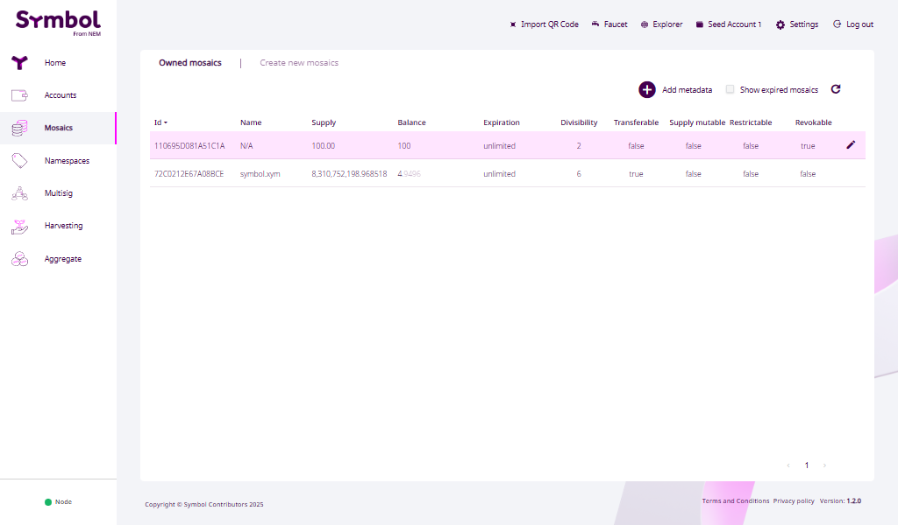
図4-1 モザイク画面

名前はなくIDだけの味気ないものです。
それで問題ありません。

これが、今作ったモザイクです。

## 4.4 受信するアカウントを作る

モザイクを定義・作成したので、送ってみましょう。
送るには相手が必要なので、ニーモニックから新たにアカウントを生成します。

### 4.4.1 コード上で生成する

第1章では、インデックスが`0`でしたが、`1`にすると2つ目のアカウントが生成されます。

<!-- 1章のコードを流用 -->

```ts
const bip32Path = facade.bip32Path(1); // 2つ目のアカウント
```

ここでは、コードのこの箇所を変更すれば次のアカウントが生成されるかを押さえておくだけでよいです。

### 4.4.2 ウォレットに追加する

ウォレットには、すでにニーモニックが登録されているので、シードアカウントの追加で、2つ目のアカウントを簡単に登録することができます。

Account タブを表示し、Add an account を押す。

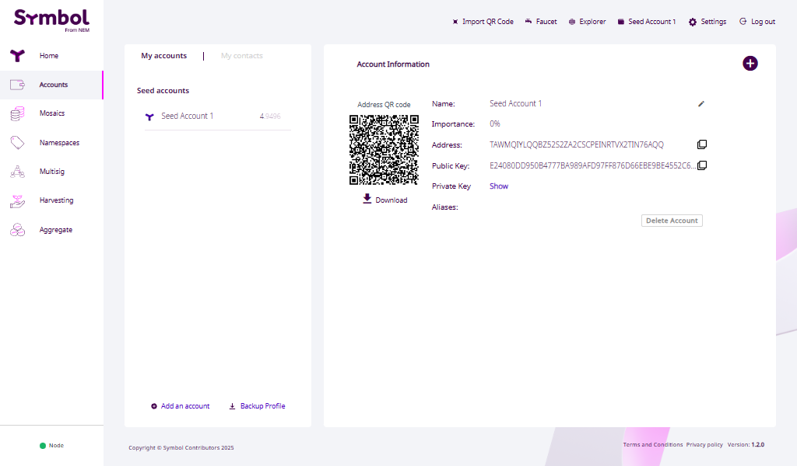
図4-1 モザイク画面

- Select the type of account はそのまま。
- New account name に任意のアカウント名。
- Password は、ウォレットにログインするときのパスワードを入力。

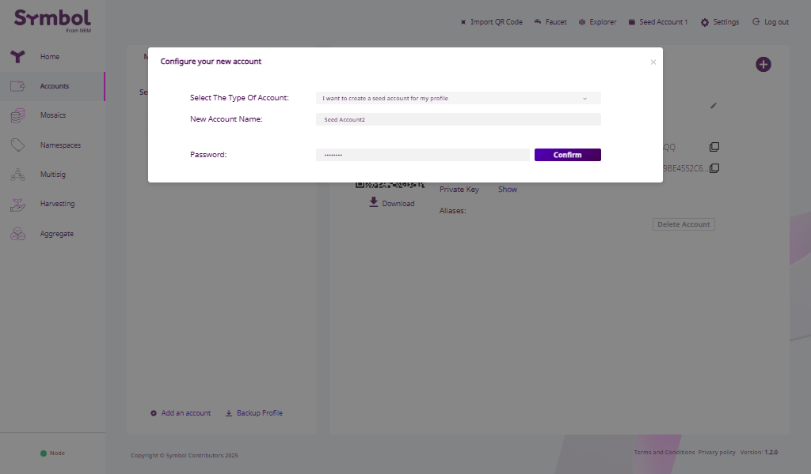
図4-1 モザイク画面

新しいアカウントが登録されます。

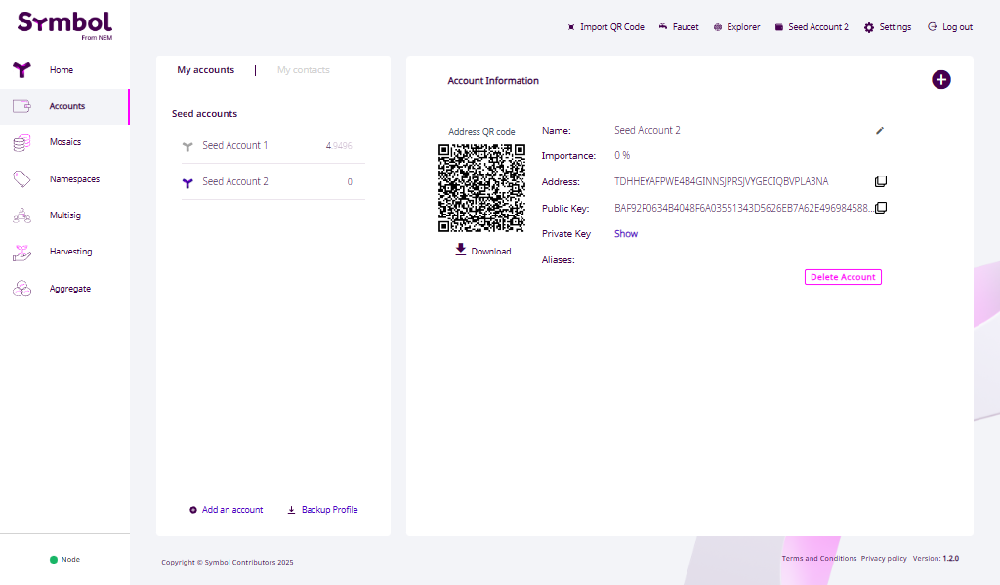
図4-1 モザイク画面

## 4.5 モザイクを送ってみる

### 4.5.1 ファイルを作る

次のファイルを作成してください。

`4_5_mosaic.ts`

### 4.5.2 モザイクを送るコードを書く

```ts
import { Bip32 } from "symbol-sdk";
import {
  descriptors,
  models,
  Network,
  SymbolFacade,
  SymbolTransactionFactory,
} from "symbol-sdk/symbol";

const NODE_URL = "https://sym-test-01.opening-line.jp:3001";

// 第1章で作成したニーモニックを貼り付ける
// const mnemonic = "ここに自分のニーモニックを書く";
const mnemonic = "word1 word2 word3 word4 ...";
const password = "";
const bip32Node = new Bip32().fromMnemonic(mnemonic, password);

// アカウント生成
const facade = new SymbolFacade(Network.TESTNET);
const bip32Path = facade.bip32Path(0); // 最初のアカウント
const childBip32Node = bip32Node.derivePath(bip32Path);
const keypair = SymbolFacade.bip32NodeToKeyPair(childBip32Node);
const account = facade.createAccount(keypair.privateKey);
// 2つ目のアカウント生成
const bip32Path2 = facade.bip32Path(1); // 2つ目のアカウント
const childBip32Node2 = bip32Node.derivePath(bip32Path2);
const keypair2 = SymbolFacade.bip32NodeToKeyPair(childBip32Node2);
const account2 = facade.createAccount(keypair2.privateKey);

// 転送モザイク設定
const mosaics = [
  new descriptors.UnresolvedMosaicDescriptor(
    new models.UnresolvedMosaicId(0x110695d081a51c1an), // 作成したモザイクID
    new models.Amount(1_00n), // 転送量
  ),
];

// 転送トランザクションディスクリプタ生成
const transferTxDescriptor = new descriptors.TransferTransactionV1Descriptor(
  account2.address, // 受信者アドレス（2つ目のアカウント）
  mosaics, // 転送モザイク
  undefined, // メッセージ
);
// 転送トランザクション生成
const transferTx = facade.createTransactionFromTypedDescriptor(
  transferTxDescriptor,
  account.publicKey, // 送信者公開鍵
  100, // 手数料係数
  60 * 60 * 2, // 有効期限(秒)
);

// 転送トランザクションに署名
const sig = account.signTransaction(transferTx);
const payloadJsonString = SymbolTransactionFactory.attachSignature(
  transferTx,
  sig,
);

// ノードへアナウンス（送信）
fetch(new URL("/transactions", NODE_URL), {
  method: "PUT",
  headers: { "Content-Type": "application/json" },
  body: payloadJsonString,
})
  .then((res) => res.json())
  .then((json) => {
    console.log(JSON.stringify(json));
  })
  .catch((err) => {
    console.error(err);
  });
```

### 4.5.3 実行する

次のコマンドを実行します。

```bash
npx tsx 4_5_mosaic.ts
```

実行後、次のような表示が出ます。

```text
{"message":"packet 9 was pushed to the network via /transactions"}
```

この表示が出れば、
トランザクションは送信されています。

### 4.5.4 ウォレットで確認する

トランザクション履歴に表示されるので確認してみましょう。

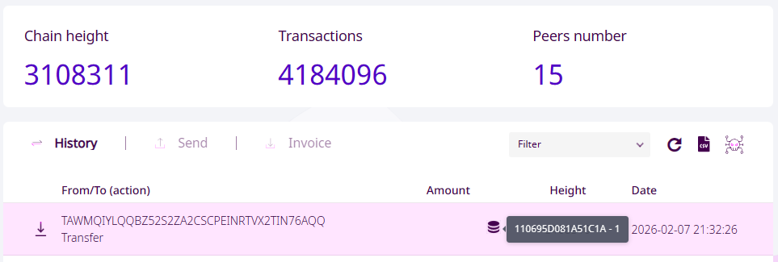
図4-1 ホーム画面 - トランザクション履歴

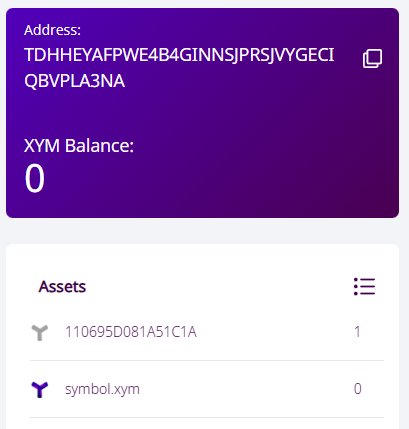<br>
図4-1 ホーム画面 - Assets

Assets に作成したモザイクIDで1だけあることが確認できます。

このモザイクは、転送不可になっているので、別アカウントへ転送することはできません。

ここまでで、
このモザイクは相手のアカウントにあります。

普通の送金であれば、
ここで関係は終わりです。

## 4.6 モザイクを取り上げる（リヴォーク）

次は、転送したモザイクを取り上げてみましょう。
作成したモザイクは、リヴォークフラグをONにしているので、一方的に取り上げることができます。

### 4.6.1 ファイルを作る

次のファイルを作成してください。

`4_6_mosaic.ts`

### 4.6.2 モザイクを送るコードを書く

```ts
import { Bip32 } from "symbol-sdk";
import {
  descriptors,
  models,
  Network,
  SymbolFacade,
  SymbolTransactionFactory,
} from "symbol-sdk/symbol";

const NODE_URL = "https://sym-test-01.opening-line.jp:3001";

// 第1章で作成したニーモニックを貼り付ける
// const mnemonic = "ここに自分のニーモニックを書く";
const mnemonic = "word1 word2 word3 word4 ...";
const password = "";
const bip32Node = new Bip32().fromMnemonic(mnemonic, password);

// アカウント生成
const facade = new SymbolFacade(Network.TESTNET);
const bip32Path = facade.bip32Path(0); // 最初のアカウント
const childBip32Node = bip32Node.derivePath(bip32Path);
const keypair = SymbolFacade.bip32NodeToKeyPair(childBip32Node);
const account = facade.createAccount(keypair.privateKey);
// 2つ目のアカウント生成
const bip32Path2 = facade.bip32Path(1); // 2つ目のアカウント
const childBip32Node2 = bip32Node.derivePath(bip32Path2);
const keypair2 = SymbolFacade.bip32NodeToKeyPair(childBip32Node2);
const account2 = facade.createAccount(keypair2.privateKey);

// リヴォークモザイク設定
const mosaics = new descriptors.UnresolvedMosaicDescriptor(
  new models.UnresolvedMosaicId(0x110695d081a51c1an), // 作成したモザイクID
  new models.Amount(1_00n), // リヴォーク量
);

// リヴォークトランザクションディスクリプタ生成
const revokeTxDescriptor =
  new descriptors.MosaicSupplyRevocationTransactionV1Descriptor(
    account2.address,
    mosaics,
  );
// リヴォークトランザクション生成
const revokeTx = facade.createTransactionFromTypedDescriptor(
  revokeTxDescriptor,
  account.publicKey, // 送信者公開鍵
  100, // 手数料係数
  60 * 60 * 2, // 有効期限(秒)
) as models.MosaicSupplyRevocationTransactionV1;

// リヴォークトランザクションに署名
const sig = account.signTransaction(revokeTx);
const payloadJsonString = SymbolTransactionFactory.attachSignature(
  revokeTx,
  sig,
);

// ノードへアナウンス（送信）
fetch(new URL("/transactions", NODE_URL), {
  method: "PUT",
  headers: { "Content-Type": "application/json" },
  body: payloadJsonString,
})
  .then((res) => res.json())
  .then((json) => {
    console.log(JSON.stringify(json));
  })
  .catch((err) => {
    console.error(err);
  });
```

### 4.6.3 実行する

次のコマンドを実行します。

```bash
npx tsx 4_6_mosaic.ts
```

実行後、次のような表示が出ます。

```text
{"message":"packet 9 was pushed to the network via /transactions"}
```

この表示が出れば、
トランザクションは送信されています。

### 4.6.4 ウォレットで確認する

トランザクション履歴に表示されるので確認してみましょう。

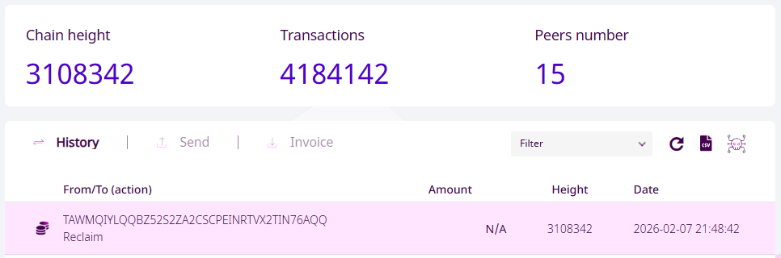
図4-1 ホーム画面 - トランザクション履歴

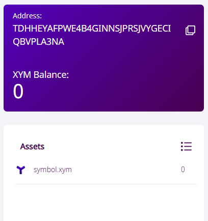<br>
図4-1 ホーム画面 - Assets

Assets から作成したモザイクIDが消えたことが確認できます。

## 4.7 この章のまとめ

- モザイクを1つ作成できた
- ウォレットで確認できた
- Symbol 上に「後から触られるもの」を作った

ここまで来ると、
Symbol は
「ただ送るだけの仕組み」ではなくなります。

次は、
このモザイクやアカウントに
意味をあとから足してみましょう。

# 第5章 意味をあとから足す（メタデータ）

この章では、
自分以外のアカウントにメタデータを付けます。

これまで作ってきたものは、

自分のアカウント

自分のトランザクション

自分のモザイク

すべて「自分のもの」でした。

ここでは、
他人が関わる世界に一歩踏み込みます。

## 5.1 この章の目的

この章の目的は、次の3つです。

- 別のアカウントに意味を付ける
- 相手の同意を含めてトランザクションを成立させる
- モザイクとの違いを体験する

メタデータを「理解する」ことではありません。
成立させるところまで進むことが目的です。

## 5.2 メタデータは「相手の許可」が必要

メタデータは、

- 説明を付ける
- ラベルを貼る
- 情報を補足する

といった用途で使われます。

どれも共通しているのは、
誰かに意味を与える行為だという点です。

そのため Symbol では、
メタデータは
一方的には付けられない仕組みになっています。

## 5.3 ファイルを作る

次のファイルを作成してください。

`5_metadata.ts`

## 5.4 メタデータを設定するコードを書く

`5_metadata.ts` を開き、
次のコードを入力してください。

このコードでは、

- メタデータを書き込むトランザクションを作り
- 両方のアカウントで署名し
- ネットワークに送信します

途中で出てくるトランザクションの名前や形式は、
今は気にしなくて構いません。

そのまま写して、実行してください。

```ts
import { Bip32, utils } from "symbol-sdk";
import {
  descriptors,
  metadataGenerateKey,
  models,
  Network,
  SymbolFacade,
  SymbolTransactionFactory,
} from "symbol-sdk/symbol";

const NODE_URL = "https://sym-test-01.opening-line.jp:3001";

// 第1章で作成したニーモニックを貼り付ける
// const mnemonic = "ここに自分のニーモニックを書く";
const mnemonic = "word1 word2 word3 word4 ...";
const password = "";
const bip32Node = new Bip32().fromMnemonic(mnemonic, password);

// アカウント生成
const facade = new SymbolFacade(Network.TESTNET);
const bip32Path = facade.bip32Path(0); // 最初のアカウント
const childBip32Node = bip32Node.derivePath(bip32Path);
const keypair = SymbolFacade.bip32NodeToKeyPair(childBip32Node);
const account = facade.createAccount(keypair.privateKey);
// 2つ目のアカウント生成
const bip32Path2 = facade.bip32Path(1); // 2つ目のアカウント
const childBip32Node2 = bip32Node.derivePath(bip32Path2);
const keypair2 = SymbolFacade.bip32NodeToKeyPair(childBip32Node2);
const account2 = facade.createAccount(keypair2.privateKey);

// キーと値の設定
// メタデータは差分で更新する必要があるが、今回は新規登録のみを扱う
const metadataKey = metadataGenerateKey("account_type");
const metadataValue = new TextEncoder().encode("gold");
let metadataSizeDelta = metadataValue.length;

// アカウントメタデータ登録Tx作成
const descriptor = new descriptors.AccountMetadataTransactionV1Descriptor( // アカウントメタデータ登録Tx
  account2.address, // ターゲットアドレス
  metadataKey, // キー
  metadataSizeDelta, // サイズ差分
  metadataValue, // 値
);
const tx = facade.createEmbeddedTransactionFromTypedDescriptor(
  descriptor, // トランザクション Descriptor 設定
  account.publicKey, // 署名者公開鍵
) as models.EmbeddedAccountMetadataTransactionV1;

const embeddedTransactions = [tx];

// アグリゲートTx作成
const aggregateDescriptor =
  new descriptors.AggregateCompleteTransactionV3Descriptor(
    facade.static.hashEmbeddedTransactions(embeddedTransactions),
    embeddedTransactions,
  );
const aggregateTx = facade.createTransactionFromTypedDescriptor(
  aggregateDescriptor, // トランザクション Descriptor 設定
  account.publicKey, // 署名者公開鍵
  100, // 手数料乗数
  60 * 60 * 2, // Deadline:有効期限(秒単位)
  0, // 連署者数
) as models.AggregateCompleteTransactionV3;

// Tx作成者による署名
const sig = account.signTransaction(aggregateTx);
facade.transactionFactory.static.attachSignature(aggregateTx, sig);

// 記録先アカウントによる連署
const coSig = account2.cosignTransaction(aggregateTx, false);
aggregateTx.cosignatures.push(coSig);

// ノードへアナウンス（送信）
fetch(new URL("/transactions", NODE_URL), {
  method: "PUT",
  headers: { "Content-Type": "application/json" },
  body: JSON.stringify({ payload: utils.uint8ToHex(aggregateTx.serialize()) }),
})
  .then((res) => res.json())
  .then((json) => {
    console.log(JSON.stringify(json));
  })
  .catch((err) => {
    console.error(err);
  });
```

## 5.5 実行してみる

次のコマンドを実行します。

```bash
npx tsx 5_metadata.ts
```

コードを実行したら、
ウォレットを開いて確認してみましょう。

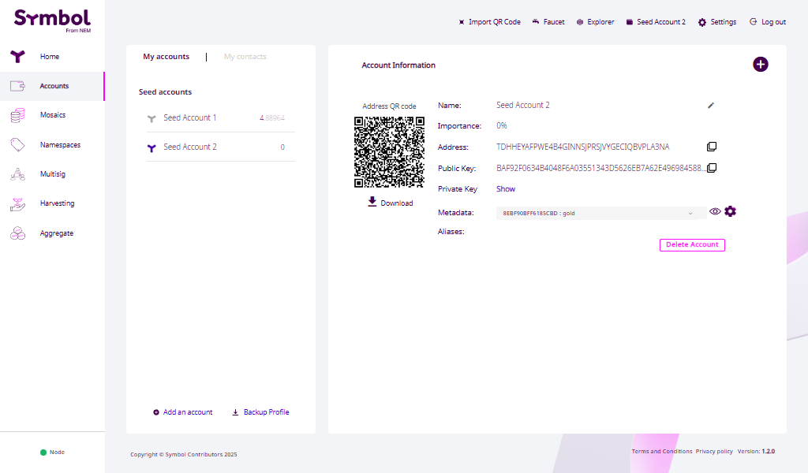<br>
図4-1 アカウント画面 - Metadata

相手のアカウントに、
設定したメタデータが表示されているはずです。

これで、
メタデータは きちんと成立 しています。

今回は、
学習用として
両方の署名をコードでそろえています。

実際には、
相手が署名しなければ
このトランザクションは成立しません。

## 5.6 モザイクとの違い

ここで、
第4章を思い出してください。

モザイクは、

- 相手の許可なしに送れました
- 相手から取り上げることもできました

とても強い操作でした。

一方、メタデータは、

- 相手の同意が必要で
- 一人では成立しません

その代わり、
両方が合意すれば、
確実に残ります。

## 5.7 この章のまとめ

この章では、

- 他人のアカウントに
- メタデータを設定し
- 同意をそろえて成立させました

これは、
第4章のモザイクとは
まったく違う種類の成功です。

一人で完結する成功ではなく、
誰かと揃って初めて成立する成功です。

ここまでで、
Symbol の基本的な要素は
すべて体験しました。

# おわりに

ここまで、
Symbol を少しだけ触ってきました。

アカウントを作り

トランザクションを送り

モザイクを作り、取り上げ

メタデータを成立させました

どれも、
深く理解する必要はありません。

この本でやったことは、
Symbol を使いこなすことではなく、
触った記憶を作ることです。

Symbol は、
説明しようとすると
少し難しく見えます。

ですが実際には、

事実を記録し

価値を動かし

意味をあとから足す

という、とても素朴なことを
丁寧に分けて扱っているだけです。

この本では、

勝手にできること

同意がないとできないこと

一人で完結する操作

誰かと成立させる操作

を、
説明ではなく体験として並べました。

もし今、

「何となく違いが分かった気がする」

と思えているなら、
それで十分です。

Symbol は、
すぐに答えをくれる道具ではありません。

ですが、
一度触ったことがあれば、
必要になったときに
また戻ってくることができます。

この本は、
そのための 入口 です。

理解できなくても構いません。
忘れてしまっても問題ありません。

ただ、

「触ったことがある」

という記憶だけを、
持って帰ってください。

それが、
この本のゴールです。
